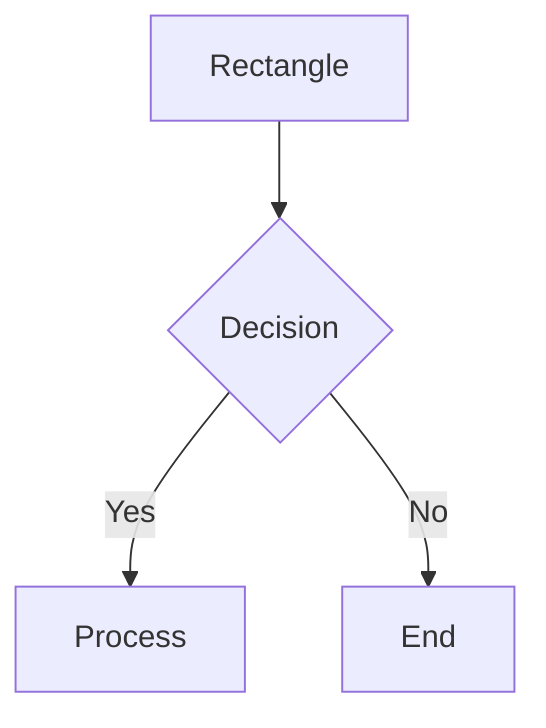
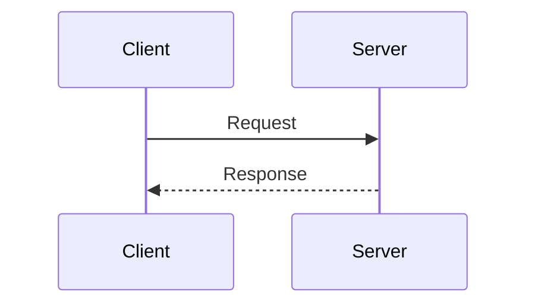
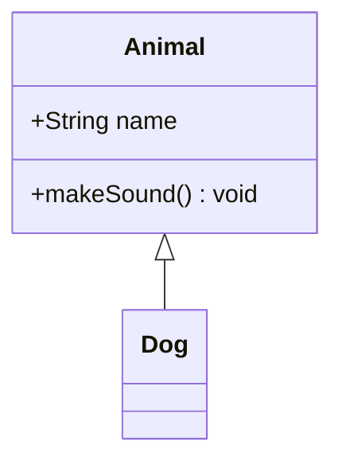
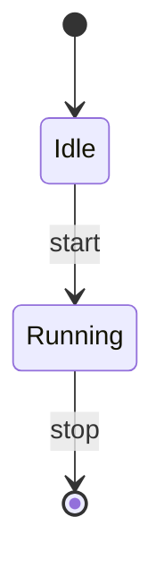
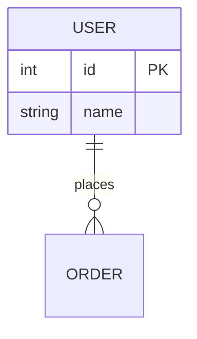

# Mermaid Validator

Validate Mermaid diagram syntax using mermaid-ast (pure static analysis, no browser required).

## Validation Process

### Step 1: Write Diagram to Temp File

```bash
cat << 'EOF' > /tmp/diagram.mmd
flowchart TD
    A[Start] --> B[Process]
    B --> C[End]
EOF
```

### Step 2: Validate with mermaid-ast

```bash
bash ${CLAUDE_PLUGIN_ROOT}/scripts/validate.sh /tmp/diagram.mmd
```

Or validate via stdin:
```bash
echo 'flowchart TD
    A --> B' | bash ${CLAUDE_PLUGIN_ROOT}/scripts/validate.sh
```

- **Success**: `✅ Valid - [diagram type]`
- **Failure**: `❌ Invalid` with error message

### Step 3: Fix Errors

Common issues to check:
- Arrow syntax (`-->` not `->` in flowcharts)
- Special characters in node IDs (wrap in quotes)
- Missing `end` keywords for blocks
- Keyword spelling (e.g., `sequenceDiagram` not `sequence`)

### Step 4: Cleanup

```bash
rm -f /tmp/diagram.mmd
```

## Supported Diagram Types

| Type | Keyword | Use Case |
|------|---------|----------|
| Flowchart | `flowchart TD` | Process flows, decision trees |
| Sequence | `sequenceDiagram` | API interactions, message flows |
| Class | `classDiagram` | OOP structures, relationships |
| State | `stateDiagram-v2` | State machines, transitions |
| ER | `erDiagram` | Database schemas |
| Gantt | `gantt` | Project schedules |
| Pie | `pie` | Data distribution |
| Mindmap | `mindmap` | Hierarchical ideas |
| Timeline | `timeline` | Chronological events |
| Git Graph | `gitGraph` | Git branch visualization |

See [references/REFERENCE.md](references/REFERENCE.md) for detailed syntax of each diagram type.

## Quick Syntax Reference

### Flowchart



Directions: `TD` (top-down), `LR` (left-right), `BT`, `RL`

### Sequence Diagram



### Class Diagram



### State Diagram



### ER Diagram



## Common Errors

### Parse error
- Check arrow format (`-->` not `->`)
- Verify keyword spelling

### Lexical error
- Wrap text with special chars in quotes: `A["Value: 100"]`

### Unknown diagram type
- Use exact keywords: `flowchart`, `sequenceDiagram`, `classDiagram`
- Supported: flowchart, sequence, class, state, erDiagram, gantt, gitGraph, mindmap, journey, kanban, pie, timeline, sankey, quadrant, requirement, xychart, c4, block

## Output Format

### Success
```
✅ Valid - flowchart
```

### Error
```
❌ Invalid
Failed to parse flowchart: Parse error on line 2:
flowchart TD    A -> B
------------------^
Expecting 'SEMI', 'NEWLINE', 'EOF', 'AMP', 'START_LINK', 'LINK', 'LINK_ID', got 'MINUS'
```

The error shows:
- Diagram type that failed
- Line number
- Visual pointer to error location
- Expected vs actual tokens
