# Mermaid Syntax Reference

Complete syntax reference for all supported diagram types.

## Flowchart

### Basic Structure

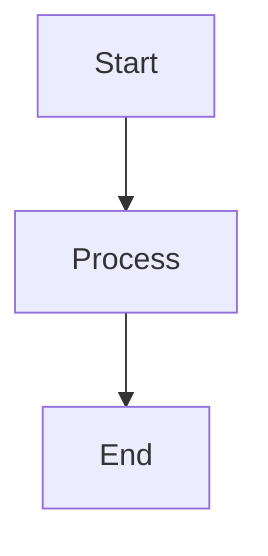

### Direction

| Code | Direction |
|------|-----------|
| `TD` / `TB` | Top to Bottom |
| `BT` | Bottom to Top |
| `LR` | Left to Right |
| `RL` | Right to Left |

### Node Shapes

| Syntax | Shape |
|--------|-------|
| `[text]` | Rectangle |
| `(text)` | Rounded rectangle |
| `{text}` | Diamond (decision) |
| `((text))` | Circle |
| `>text]` | Flag |
| `[[text]]` | Subroutine |
| `[(text)]` | Cylinder (database) |
| `{{text}}` | Hexagon |
| `[/text/]` | Parallelogram |
| `[\text\]` | Parallelogram alt |

### Arrow Types

| Syntax | Description |
|--------|-------------|
| `-->` | Arrow |
| `---` | Line (no arrow) |
| `-.->` | Dotted arrow |
| `==>` | Thick arrow |
| `--text-->` | Arrow with label |
| `-->｜text｜` | Alternative label syntax |
| `~~~` | Invisible link |

### Subgraphs

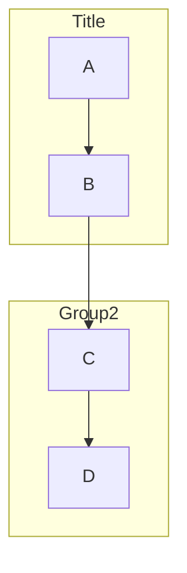

### Styling

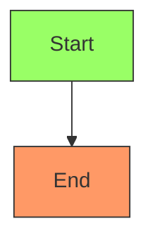

---

## Sequence Diagram

### Basic Structure

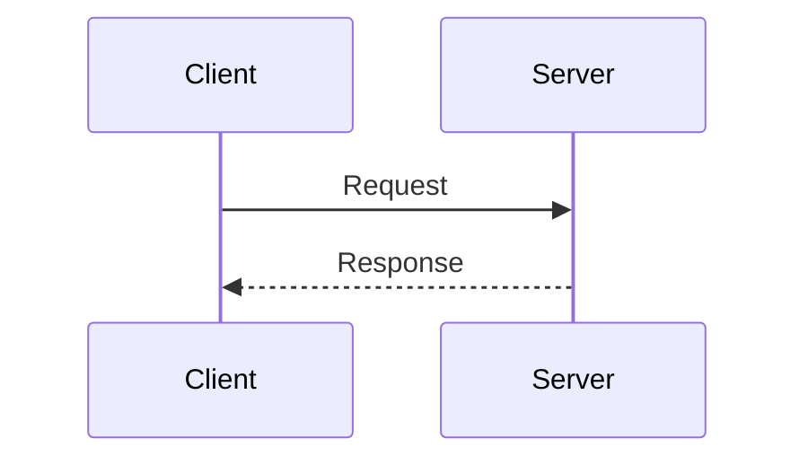

### Arrow Types

| Syntax | Description |
|--------|-------------|
| `->>` | Solid arrow |
| `-->>` | Dotted arrow |
| `-x` | Solid with X (async) |
| `--x` | Dotted with X |
| `-)` | Solid open arrow |
| `--)` | Dotted open arrow |

### Activation

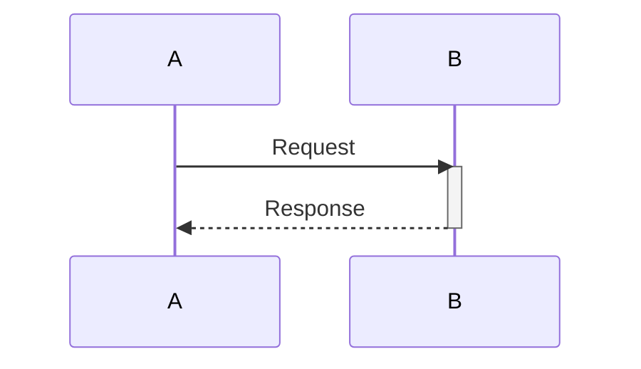

Or shorthand:
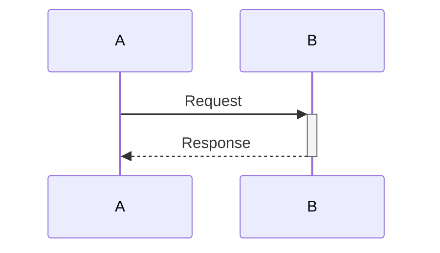

### Notes

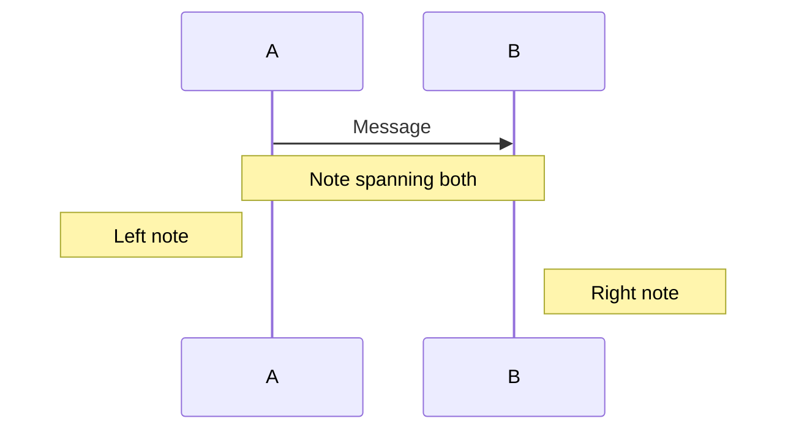

### Control Flow

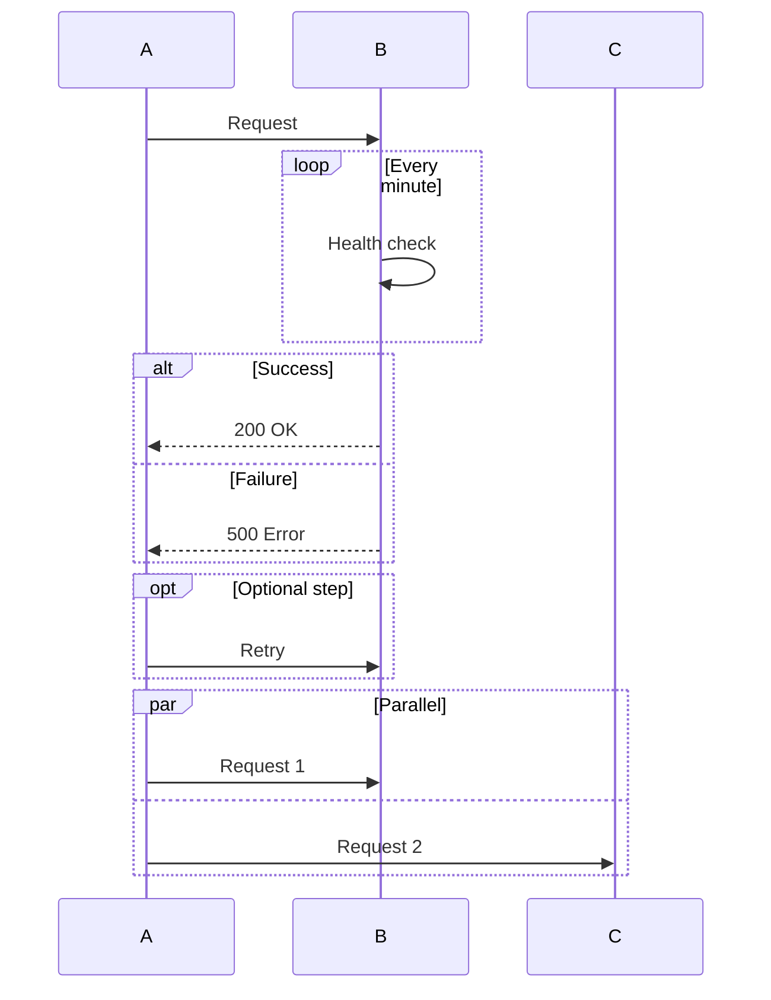

### Background Highlighting

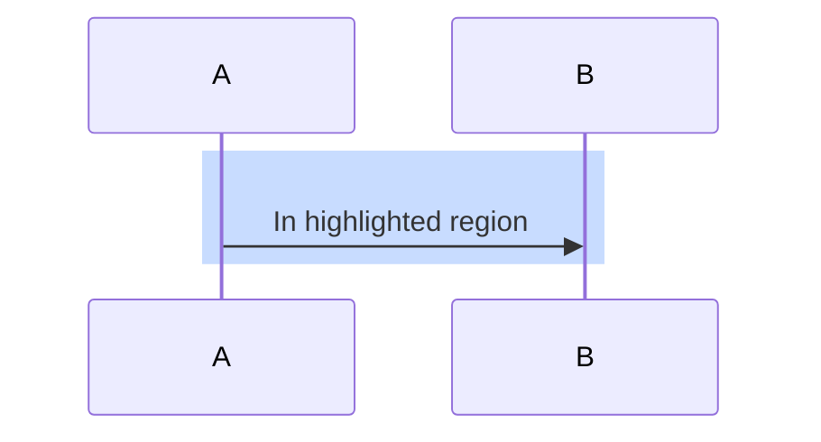

### Auto-numbering

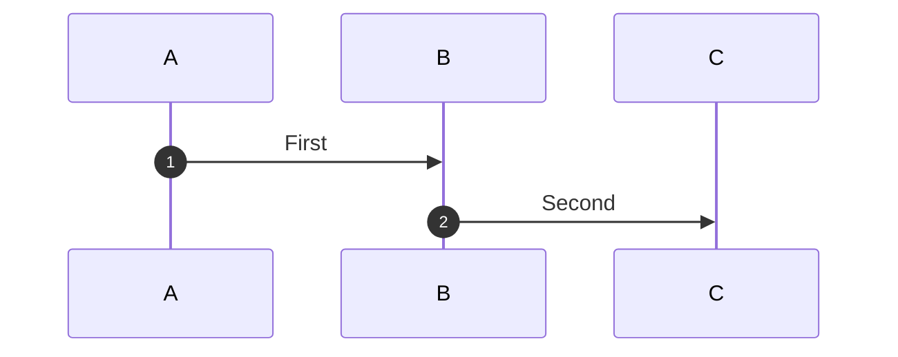

---

## Class Diagram

### Basic Structure

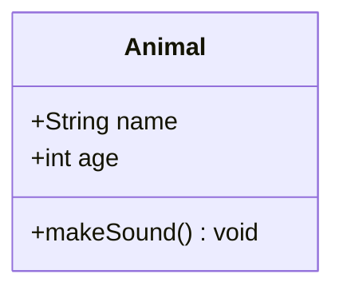

### Visibility

| Symbol | Visibility |
|--------|------------|
| `+` | Public |
| `-` | Private |
| `#` | Protected |
| `~` | Package/Internal |

### Relationships

| Syntax | Relationship |
|--------|--------------|
| `<｜--` | Inheritance |
| `*--` | Composition |
| `o--` | Aggregation |
| `-->` | Association |
| `--` | Link (solid) |
| `..>` | Dependency |
| `..｜>` | Implementation |
| `..` | Link (dashed) |

### Cardinality

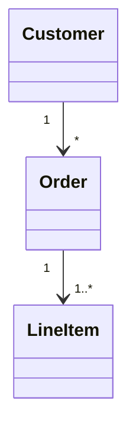

Labels: `"1"`, `"0..1"`, `"1..*"`, `"*"`, `"n"`

### Annotations

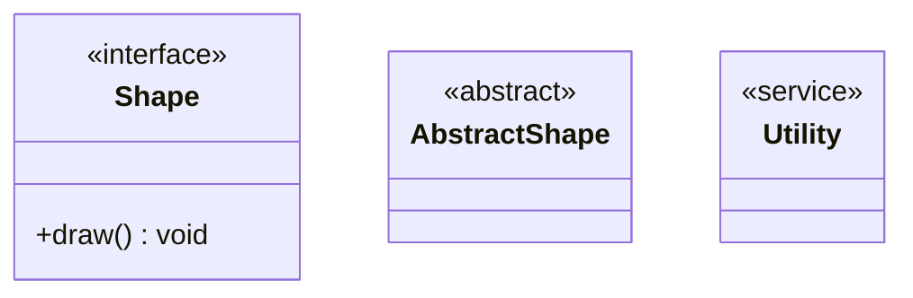

---

## State Diagram

### Basic Structure

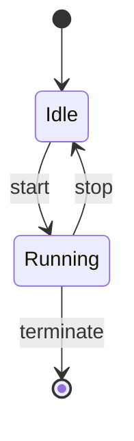

### Composite States

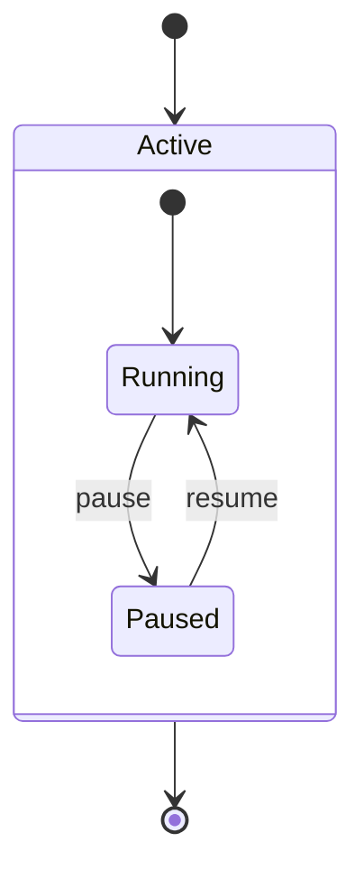

### Concurrent States

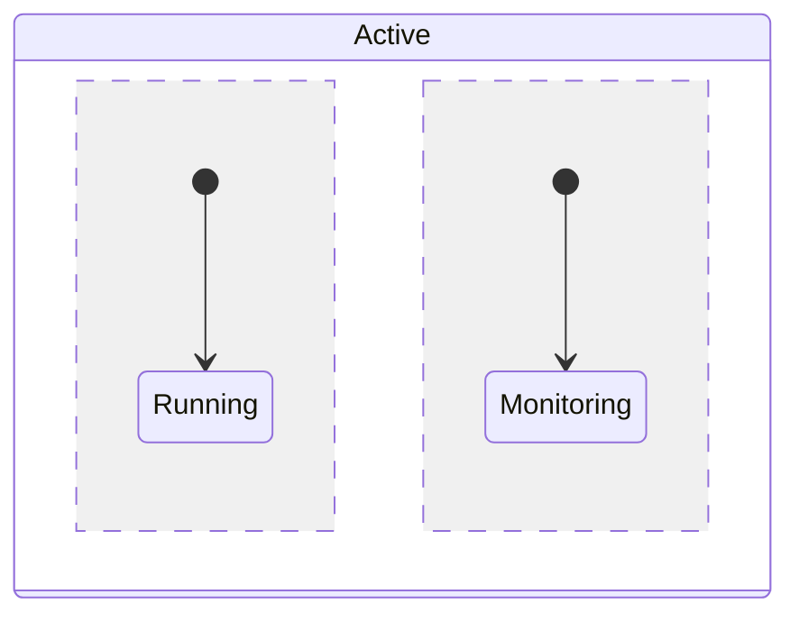

### Special States

| Syntax | State |
|--------|-------|
| `[*]` | Start/End |
| `<<fork>>` | Fork |
| `<<join>>` | Join |
| `<<choice>>` | Choice |

### Notes

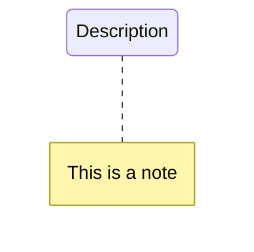

---

## ER Diagram

### Basic Structure

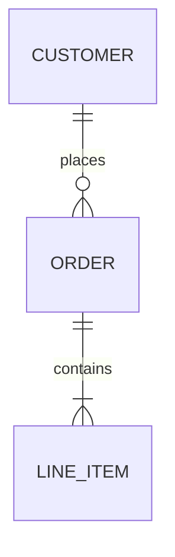

### Cardinality

| Left | Right | Meaning |
|------|-------|---------|
| `｜｜` | `｜｜` | Exactly one |
| `｜｜` | `o｜` | Zero or one |
| `｜｜` | `}｜` | One or more |
| `｜｜` | `}o` | Zero or more |

### Attributes

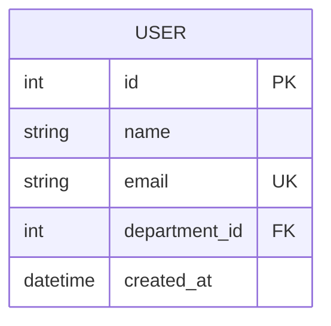

Markers: `PK` (Primary Key), `FK` (Foreign Key), `UK` (Unique Key)

---

## Gantt Chart

### Basic Structure

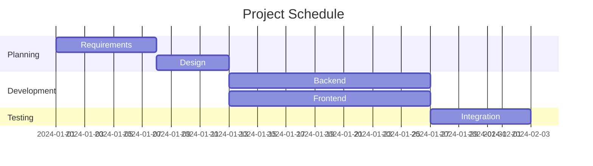

### Task Types

| Syntax | Type |
|--------|------|
| `:active` | Active task |
| `:done` | Completed task |
| `:crit` | Critical path |
| `:milestone` | Milestone |

Example:
```mermaid
gantt
    Planning    :done, a1, 2024-01-01, 7d
    Development :active, a2, after a1, 14d
    Review      :crit, a3, after a2, 3d
    Launch      :milestone, m1, after a3, 0d
```

---

## Pie Chart

### Basic Structure

```mermaid
pie showData
    title Browser Market Share
    "Chrome" : 65
    "Safari" : 19
    "Firefox" : 10
    "Other" : 6
```

Options:
- `showData`: Display percentages
- `title`: Chart title

---

## Best Practices

1. **Use meaningful IDs**: `userService` not `A`
2. **Keep diagrams focused**: One concept per diagram
3. **Use consistent styling**: Same direction and arrow types
4. **Quote special characters**: `["Value: 100"]`
5. **Validate incrementally**: Add sections one at a time
6. **Use subgraphs/states**: Improve readability of complex diagrams
