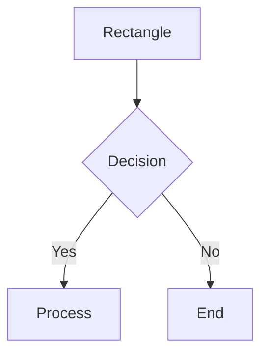
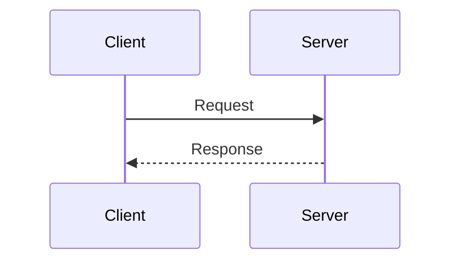
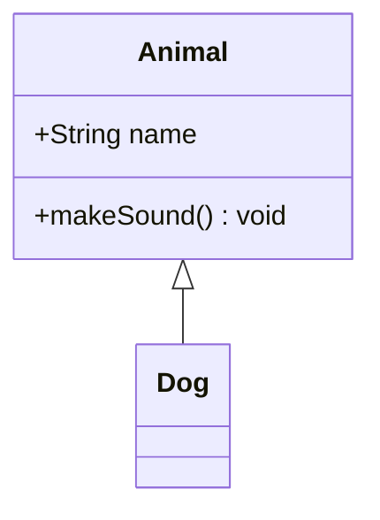
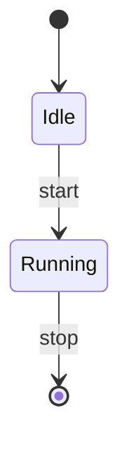
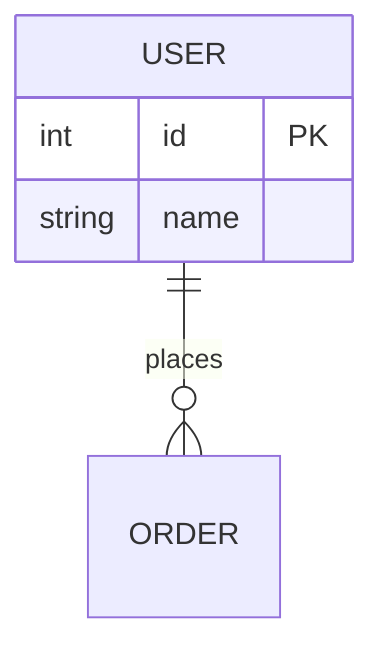

# Mermaid Validator

Create syntactically correct Mermaid diagrams and validate them using the official mermaid-cli.

## Validation Process

### Step 1: Check mmdc Installation

```bash
npx -p @mermaid-js/mermaid-cli mmdc --version
```

If not available, guide user to install:
```bash
npm install -g @mermaid-js/mermaid-cli
```

### Step 2: Write Diagram to Temp File

```bash
cat << 'EOF' > /tmp/diagram.mmd
flowchart TD
    A[Start] --> B[Process]
    B --> C[End]
EOF
```

### Step 3: Validate with mmdc

```bash
npx -p @mermaid-js/mermaid-cli mmdc -i /tmp/diagram.mmd -o /tmp/diagram.svg 2>&1
```

- **Success**: SVG file generated
- **Failure**: Parse error message identifies the issue

### Step 4: Fix Errors

Common issues to check:
- Arrow syntax (`-->` not `->` in flowcharts)
- Special characters in node IDs (wrap in quotes)
- Missing `end` keywords for blocks
- Keyword spelling (e.g., `sequenceDiagram` not `sequence`)

### Step 5: Cleanup

```bash
rm -f /tmp/diagram.mmd /tmp/diagram.svg
```

## Supported Diagram Types

| Type | Keyword | Use Case |
|------|---------|----------|
| Flowchart | `flowchart TD` | Process flows, decision trees |
| Sequence | `sequenceDiagram` | API interactions, message flows |
| Class | `classDiagram` | OOP structures, relationships |
| State | `stateDiagram-v2` | State machines, transitions |
| ER | `erDiagram` | Database schemas |
| Gantt | `gantt` | Project schedules |
| Pie | `pie` | Data distribution |

See [references/REFERENCE.md](references/REFERENCE.md) for detailed syntax of each diagram type.

## Quick Syntax Reference

### Flowchart



Directions: `TD` (top-down), `LR` (left-right), `BT`, `RL`

### Sequence Diagram



### Class Diagram



### State Diagram



### ER Diagram



## Common Errors

### Parse error
- Check arrow format (`-->` not `->`)
- Verify keyword spelling

### Lexical error
- Wrap text with special chars in quotes: `A["Value: 100"]`

### Unknown diagram type
- Use exact keywords: `flowchart`, `sequenceDiagram`, `classDiagram`

## Output Format

```
## Mermaid Validation Result

**Status**: ✅ Success / ❌ Error

### Diagram Code
\`\`\`mermaid
[validated code]
\`\`\`

### Validation Command
\`\`\`bash
npx -p @mermaid-js/mermaid-cli mmdc -i /tmp/diagram.mmd -o /tmp/diagram.svg
\`\`\`

### Error Details (if applicable)
- Line: X
- Error: [message]
- Fix: [suggestion]
```
